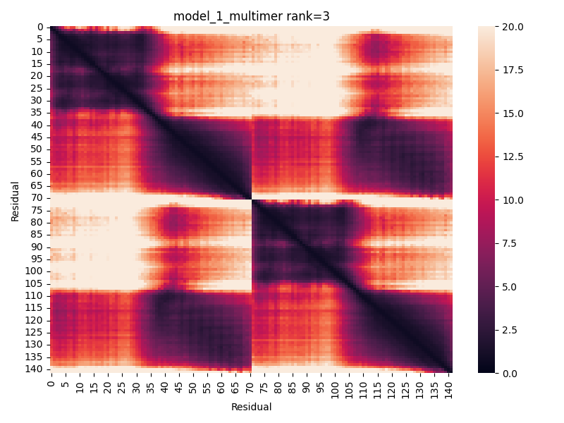
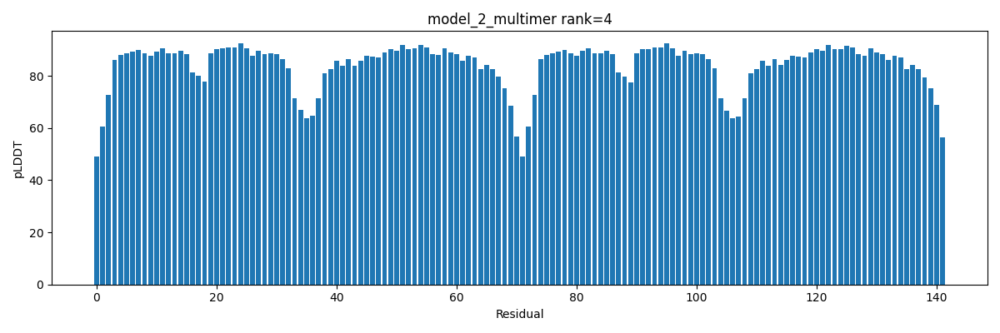
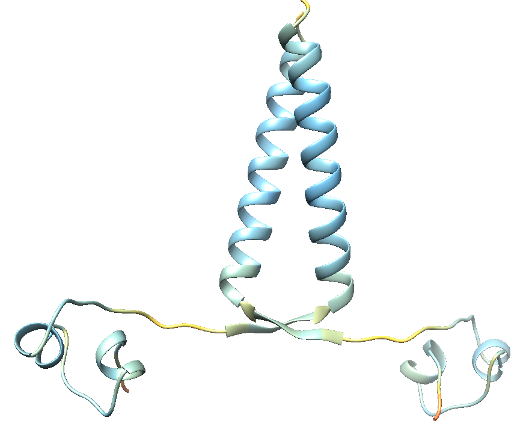

# Run AlphaFold2 step by step

AlphaFold2 (and AlphaFold-Multimer) running process is splited into four parts:

1. Search homologous sequences and templates
2. Run models 1-5 to produce the unrelaxed models
3. Relax models
4. Sort models by confidence score

### Usage

1. Install [AlphaFold v2.2](https://github.com/deepmind/alphafold/releases/tag/v2.2.0)

2. Install Python packages

   ```bash
   pip install -U scikit-learn
   pip install -U matplotlib
   pip install -U seaborn
   ```

3. Download `AlphaFold-StepByStep`

   ```bash
   git clone https://github.com/lipan6461188/AlphaFold-StepByStep.git
   cd AlphaFold-StepByStep
   chmod +x *.py
   export PATH=$(pwd):$PATH
   ```

4. Set `config.ini`

   ```ini
   [ALPHAFOLD2]
   alphafold_path = /path/to/alphafold-2.2.0
   
   [EXCUTABLE]
   jackhmmer_binary_path       = 
   hhblits_binary_path         = 
   hhsearch_binary_path        = 
   hmmsearch_binary_path       = 
   hmmbuild_binary_path        = 
   kalign_binary_path          = 
   
   [DATABASE]
   params_parent_dir           = /AF2_db
   uniref90_database_path      = /AF2_db/uniref90/uniref90.fasta
   mgnify_database_path        = /AF2_db/mgnify/mgy_clusters.fa
   template_mmcif_dir          = /AF2_db/pdb_mmcif/mmcif_files
   obsolete_pdbs_path          = /AF2_db/pdb_mmcif/obsolete.dat
   uniprot_database_path       = /AF2_db/uniprot/uniprot.fasta
   pdb_seqres_database_path    = /AF2_db/pdb_mmcif/pdb_seqres_old.txt
   uniclust30_database_path    = /AF2_db/uniclust30/UniRef30_2020_02
   bfd_database_path           = /AF2_db/bfd/bfd_metaclust_clu_complete_id30_c90_final_seq.sorted_opt
   ```

5. Run `AlphaFold-StepByStep`

   Run the complete process：

   ```bash
   # AlphaFold-Multimer
   run_af_multimer.py examples/1ajy.fasta examples/1ajy
   # Add --skip_refine to skip the relax process
   
   # AlphaFold2
   run_af2.py examples/1ajy_A.fasta examples/1ajy_A
   ```

   Optional, you can run AlphaFold2 (and Multimer) step by step：

   ```bash
   # Step 1: Search homologous sequences and templates (Use CPU)
   run_af_multimer_step1.py examples/1ajy.fasta examples/1ajy
   
   # Step 2: Run models 1-5 to produce the unrelaxed models (Use GPU)
   export CUDA_VISIBLE_DEVICES="1" # which GPU card to use
   run_af_multimer_step2.py examples/1ajy/features.pkl.gz examples/1ajy
   
   # Step 3: Relax models (Use CPU)
   for idx in $(seq 1 5);
   do
   	run_af_multimer_step3.py \
         examples/1ajy/unrelaxed_model_${idx}_multimer.pdb \
         examples/1ajy/relaxed_model_${idx}_multimer.pdb
   done
   
   # Step 4: Sort and visualize (Use CPU)
   cd examples/1ajy
   run_af_multimer_step4.py result_model_1_multimer.pkl,result_model_2_multimer.pkl,result_model_3_multimer.pkl,result_model_4_multimer.pkl,result_model_5_multimer.pkl relaxed_model_1_multimer.pdb,relaxed_model_2_multimer.pdb,relaxed_model_3_multimer.pdb,relaxed_model_4_multimer.pdb,relaxed_model_5_multimer.pdb ./
   ```

### Outputs

#### predicted_aligned_error



#### pLDDT



#### Protein structure



Visualize the pLDDT with command `rangecolor bfactor, 50 #f08253 70 #fada4d 90 #7ec9ef 100 #1b57ce` in [UCSF Chimera](https://www.cgl.ucsf.edu/chimera/).

